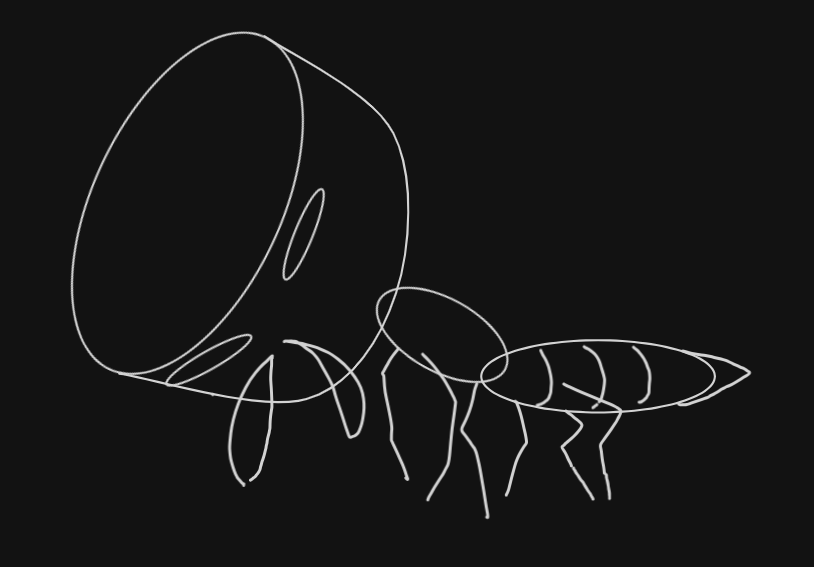
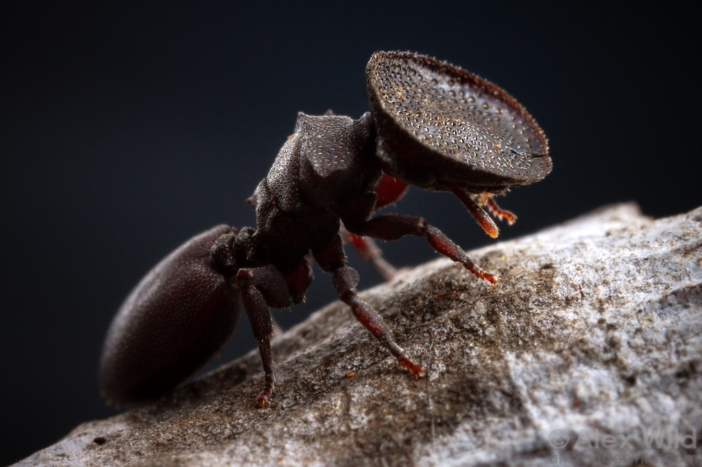
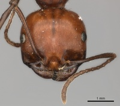
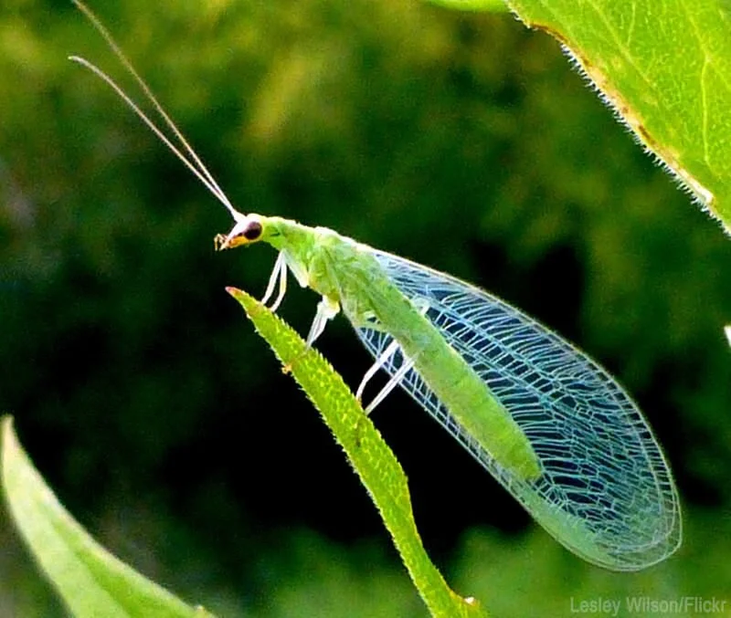
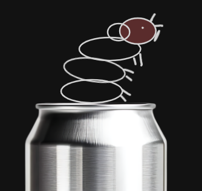
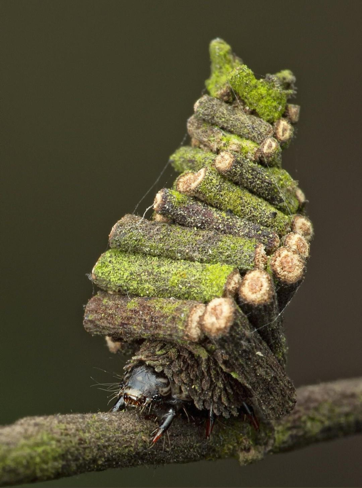

# Smiduweorc

We don't have an inspiring quote, we just do half code, half insect documentary.

## Our Process:
```
Make something -> runs into problem and need tool -> finds tool to solve problem -> tool broken or a bit weird -> run into hidey hole -> make tool -> forget original project
```
---

## Why insects?
They are funny but specialized and can be surprisingly effective.

---

## Cephalote



Some Cephalote heads are literally shaped like doors.

When danger approaches, they plug the nest entrance with their heads, preventing intruders from entering.

Cephalote takes inspiration from this behavior by scanning projects for weak and broken cryptography before it reaches production.

#### Fun fact

Some species of *Cephalotes* can glide through the air if they fall from trees, steering themselves back toward the trunk.

We wanted to actually use the real species since cephalote is a genus, but the name was too long and weird.

Nature is weird.

#### Pictures



Attribution: Alexander Wild `https://www.alexanderwild.com/Ants/Natural-History/Soldier-Ants/i-839Xb2z`




Attribution: Alexander Wild `https://www.antwiki.org/wiki/Messor_cephalotes`

---

## Lacewing


Lacewings are one of nature's biological BEST pest control.

Their larvae spend most of their time eating aphids and other small pests before they become a problem. So yes, [pesticide alternative](https://retail.koppert.ca/blogs/knowledge-centre/meet-the-larvae-that-will-save-your-plant-collection) in farms.

Lacewing will not be another jwt library, it just has opinions about the safety about your JWT implementation.

#### Fun fact

Lacewing larvae are commonly nicknamed **"aphid lions"** because they're surprisingly aggressive hunters despite being only a few millimetres long.

Adult lacewings and their larvae look so different that you'd probably never guess they're the same insect.

#### Pictures



Attribution: `https://www.beebetternaturally.com/blog/2020/8/23/green-lacewings-in-the-bee-better-naturally-teaching-garden`

---


## Bagworm



Bagworms build portable shelters using whatever materials they can find:

- twigs
- leaves
- bark
- sand
- ...or apparently an aluminium can. (not really, but known instances of using peeled metallic paint)

They carry these shelters everywhere they go.

Instead of caring whether you're using Docker, Podman, or another OCI runtime, Bagworm simply helps you carry your development environment with you.

#### Fun fact

A bagworm spends almost its entire life inside the case it builds.

#### Pictures



Attribution: Reddit `https://www.reddit.com/r/interestingasfuck/comments/c6x1ub/the_caterpillars_of_the_bagworm_moth_build_their/`

---

# The artwork

Every project has a hand-drawn mascot (look mum, I'm an artist).

They are intentionally simple.

They are intentionally a little goofy.

And yes, they're mostly drawn in Excalidraw.

---

# Opinions

Our projects generally follow a few ideas:

- Solve one problem well.
- Prefer opinionated defaults over endless configuration.
- Keep dependencies to a minimum.
- Ship software we'd actually want to use ourselves.
- Have a little fun along the way.
- AI is fine, so long used reasonably. One human can't know everything.
